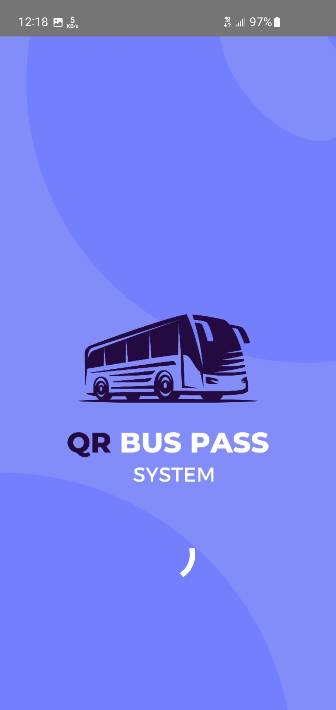
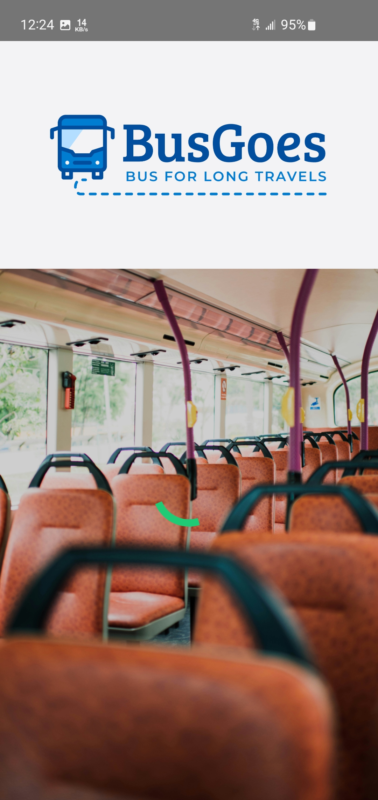
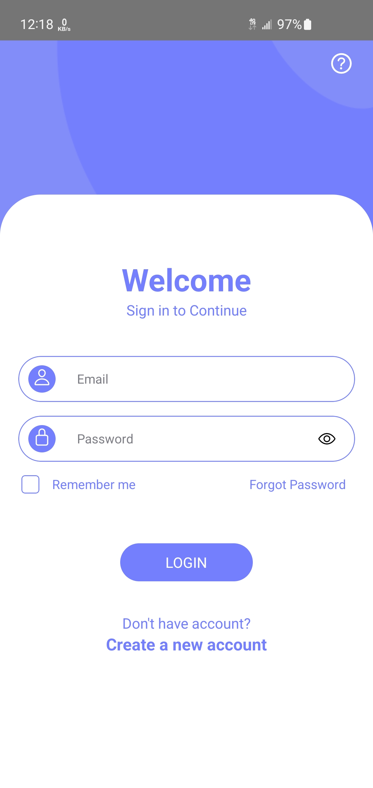
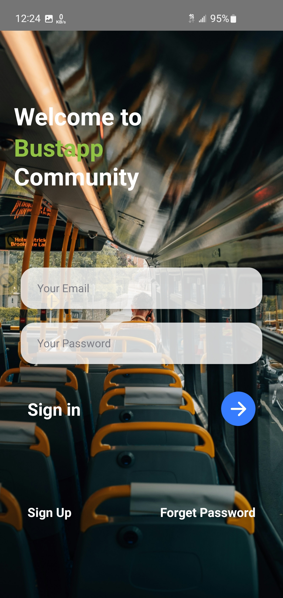
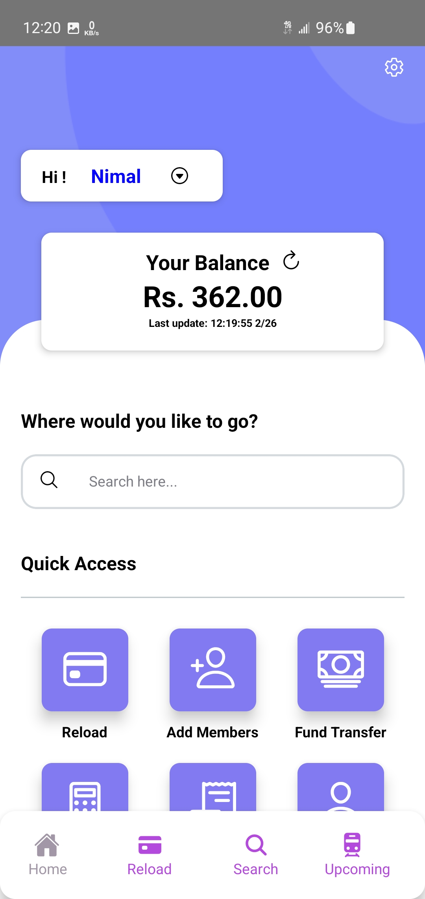
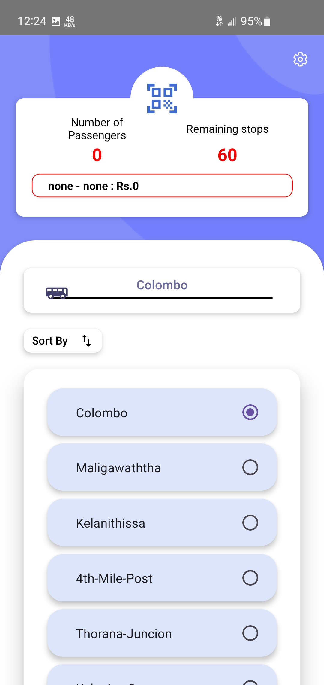
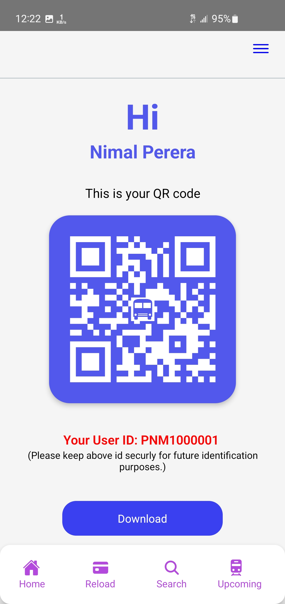
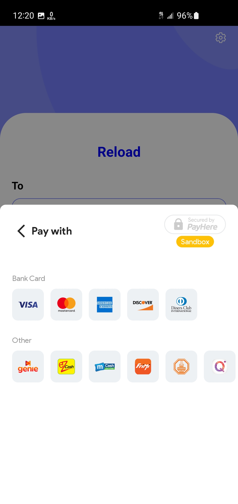
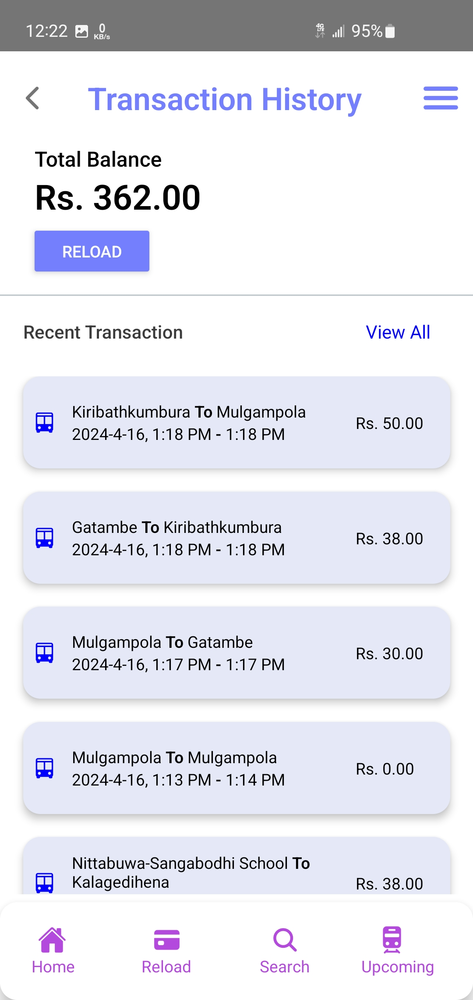
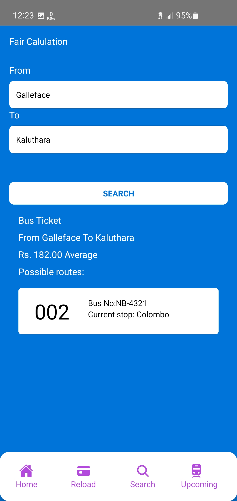

# QR-Based Bus Pass System

## Overview
The inefficiencies of traditional paper-based bus pass systems have led to delays, increased operational costs, and environmental concerns. This project proposes a simulated QR code-based bus pass system to enhance efficiency, reduce costs, and promote sustainability. By leveraging digital technology, this system provides a seamless and user-friendly experience for passengers while streamlining public transportation processes.

## Features
- **Passenger Registration**: Users can sign up and create accounts within the app.
- **QR Code Generation**: A unique QR code is generated for each bus pass, allowing quick and easy boarding.
- **Credit Balance Management**: Users can check and top up their credit balance.
- **Fare Calculation**: The app calculates fares based on selected entry and exit points.
- **Secure Payment Integration**: Users can add credit via PayHere using various payment methods.
- **Real-Time Updates**: Instant data synchronization for a seamless user experience.

## Technology Stack
### 1. Mobile Application
- Developed using **React Native** for cross-platform compatibility (Android and iOS).
- Provides an intuitive and responsive UI/UX.

### 2. Backend Database
- Uses **Firebase** for real-time data storage and synchronization.
- Manages user data, QR code generation, and fare calculations efficiently.

### 3. Payment Gateway Integration
- Integrated with **PayHere** to enable secure and seamless credit top-ups.
- Supports multiple payment methods, including credit cards and mobile payments.

## How It Works
1. **User Registration**: Passengers create an account in the mobile app.
2. **Bus Pass Generation**: A unique QR code is assigned to the user.
3. **Credit Top-Up**: Users add funds to their balance via PayHere.
4. **Boarding Process**: Passengers scan their QR code when entering the bus.
5. **Fare Calculation**: The system deducts the fare based on the entry and exit points.
6. **Real-Time Updates**: All transactions and balance updates reflect instantly in Firebase.

## Benefits
- **Efficiency**: Reduces boarding time and delays.
- **Cost-Effective**: Minimizes expenses associated with printing and distributing paper passes.
- **Environmentally Friendly**: Promotes sustainability by eliminating paper waste.
- **User Convenience**: Provides an easy-to-use digital solution for fare management.

## Screenshots
- **Splash Screen**
  
  
- **Login Screen**
  
  
- **Home Screen**
  
  
- **QR Code Generation**
  
- **Payment Interface**
  
- **Transaction History**
  
- **Fair Calculation**
  

If your screenshots are not displaying correctly, ensure you have committed and pushed the images to your GitHub repository.

## Future Enhancements
- NFC-based tap-and-go functionality
- Offline mode for QR code scanning
- AI-driven route recommendations

## Contributors
- Samarakoon S.
- SILVA A.D.K
• KAVINDI A.L.S.J 
• MANOHARI G.R.S.H 
• LAKSHAN K.A.S 
• SHAKITHTHIYAN P 

## Contact
For any inquiries or support, please contact [ssandiru@gmail.com].

